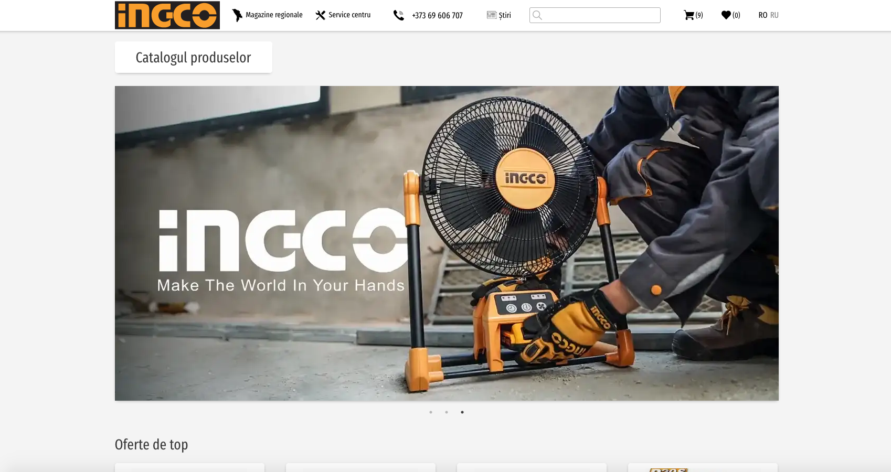

# INGCO - eCommerce



## Demo
[Website](https://www.ingco.md)

## Project description
E-commerce shop for a power tools manufacturer.

Built with Gatsby and Strapi as backend.
The site is deployed into production and handles over 900 products.
Each product has a statically generated page that is built by using the `generatePages` API.

## Installation
Clone the repository
```git clone git@github.com:bashmentarium/ecommerce.git```

Install dependencies
```yarn```

Run it
```yarn develop```

## Project debrief
An e-commerce website for a leading electrical industry company and one of the largest power tools dealers in MD.
The e-commerce website is coupled with a content management system and deployed on a static hosting provider, which empowers the team to:

 - Manage a growing inventory of over 900 products.
 - Automatic deploys
 - Static builds
 - Track stock and inventory via a third-party API
 - Reducing hosting costs while speeding up load times

The main challenges were:
 - Tracking prices and stocks amount from external service
 - Handle a growing inventory of products
 - Allowing the team to manage multiple product categories, spec sheets, blog posts, etc.
 - Having a SEO oriented strategy while being able to execute rapidly

This was a time-critical project that went from requirements elicitation to the mocked up designs, polishing and then using Gatsby.js and Strapi to build it.

Ultimately, I delivered a website with:
 - CMS backend - Powered by Strapi, deployed on Heroku
 - E-commerce Frontend - Built with Gatsby and Deployed via Netlify

